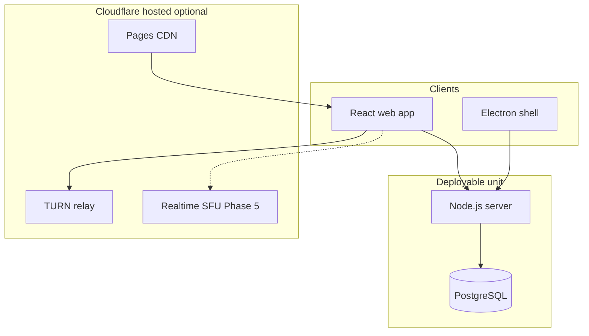

# pqp Architecture

Open-source Discord alternative. Same codebase powers **pqp.gg** (hosted) and **independent-copy** self-host deployments.

## System overview

## Monorepo layout

| Package | Purpose |
|---|---|
| [`client/`](../client) | React + Vite + Tailwind + shadcn UI |
| [`server/`](../server) | HTTP API, WebSocket chat + voice signaling, static hosting |
| [`packages/shared/`](../packages/shared) | Zod schemas, protocol types, voice backend config |
| [`electron/`](../electron) | Thin desktop shell (loads web app) |

## Data model

Discord-like hierarchy:

- **Server** — workspace / guild
- **Channel** — `text` or `voice`
- **Message** — persisted text in text channels
- **User** — synced from Clerk on first request

Creating a server bootstraps `#general` (text) and `Lobby` (voice).

## Realtime protocols

### Text chat (WebSocket)

| Direction | Type | Purpose |
|---|---|---|
| Client → Server | `join-channel` | Subscribe to a text channel |
| Client → Server | `leave-channel` | Unsubscribe |
| Client → Server | `message-create` | Send message (persisted) |
| Server → Client | `message-broadcast` | New message to subscribers |
| Server → Client | `presence-update` | Who is viewing the channel |

### Voice signaling (WebSocket)

Per **voice channel** mesh room. Same offer/answer/ICE relay as the seed MVP, scoped by `voiceChannelId`.

| Direction | Type | Purpose |
|---|---|---|
| Client → Server | `join-voice-room` | Enter voice channel |
| Client → Server | `leave-voice-room` | Leave voice channel |
| Server → Client | `welcome` | Assigned `peerId` + existing peers |
| Relayed | `offer` / `answer` / `ice-candidate` | WebRTC negotiation |

**Mesh limit:** ~5–8 users per voice channel. UI warns at 6+. SFU backends scale beyond this.

## Auth

- **Clerk** on client (`@clerk/clerk-react`)
- Server verifies JWT via `@clerk/backend`
- WebSocket auth: first message `{ type: "auth", token }` → `{ type: "ready" }`

## Voice backends (Phase 5)

`VoiceBackend` abstraction in client:

| Backend | Deployment | Status |
|---|---|---|
| `mesh` | All | **Implemented** (default) |
| `cloudflare-sfu` | pqp.gg hosted | Stub — falls back to mesh |
| `livekit` | Self-host Docker/Railway | Stub — falls back to mesh |

Set `VITE_VOICE_BACKEND=mesh` (default). Hosted production will use Cloudflare Realtime SFU; self-host uses LiveKit.

## Cloudflare — when and why

| Service | Use | Why not always |
|---|---|---|
| **TURN** | NAT traversal for mesh voice | Self-host uses coturn or env TURN |
| **Realtime SFU** | Scale voice past mesh on hosted | Not self-hostable; LiveKit for OSS |
| **Pages** | CDN for static client on pqp.gg | Self-host serves from Node |

Core API + Postgres stay on **Node/Railway/Docker** so self-host is one artifact.

## Self-host

Independent copy — your URL, your data, your Clerk instance.

- `docker-compose.yml` — app + Postgres (+ optional coturn)
- Railway template — one-click from repo
- Same env contract as hosted

## Monetization (future)

Documented intent only:

- **Plus / Pro** — hosted tiers via Clerk Billing
- **Self-host** — unlimited OSS, no account link to pqp.gg

## Electron

Thin shell loads `VITE_APP_URL` or bundled client. Configure `VITE_API_URL` / `VITE_WS_URL` for non-local backends.

## Roadmap phases

1. Auth + servers + channels + DB — **done in this release**
2. Text chat + markdown — **done**
3. Voice per channel mesh — **done**
4. Docker + Railway — **done**
5. SFU backends — stubs + docs
6. Electron + billing groundwork — **done (shell + docs)**
