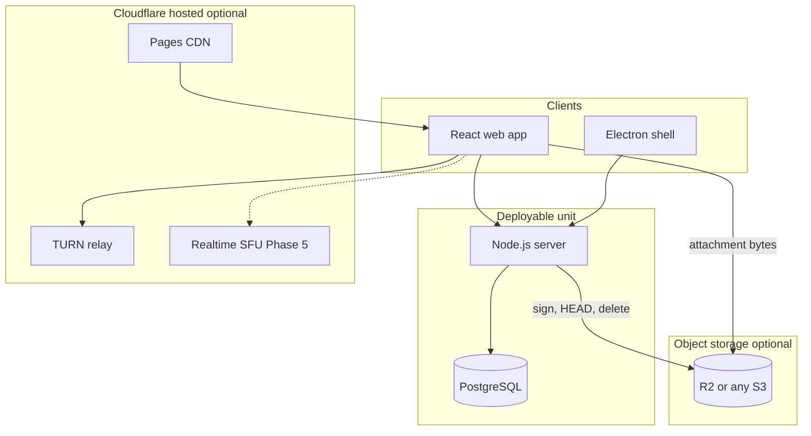

# pqp Architecture

Open-source Discord alternative. Same codebase powers **pqp.gg** (hosted) and **independent-copy** self-host deployments.

## System overview

```mermaid
flowchart TB
  subgraph clients [Clients]
    Web[React web app]
    Electron[Electron shell]
  end
  subgraph deploy [Deployable unit]
    Node[Node.js server]
    PG[(PostgreSQL)]
  end
  subgraph cf [Cloudflare hosted optional]
    Pages[Pages CDN]
    TURN[TURN relay]
    SFU[Realtime SFU Phase 5]
  end
  subgraph store [Object storage optional]
    S3[(R2 or any S3)]
  end
  Web --> Node
  Electron --> Node
  Node --> PG
  Web --> TURN
  Web -.-> SFU
  Pages --> Web
  Web -->|attachment bytes| S3
  Node -->|sign, HEAD, delete| S3
```

Note the two arrows into object storage. Attachment **bytes** go browser ↔ storage directly; the
server only ever signs URLs, reads object metadata, and deletes — on the sweeper's schedule and
when a channel or server is deleted. Nothing large transits Node.

## Monorepo layout

| Package | Purpose |
|---|---|
| [`client/`](../client) | React + Vite + Tailwind + shadcn UI |
| [`server/`](../server) | HTTP API, WebSocket chat + voice signaling, static hosting |
| [`packages/shared/`](../packages/shared) | Zod schemas, protocol types, voice backend config |
| [`electron/`](../electron) | Thin desktop shell (loads web app) |

## Data model

Discord-like hierarchy:

- **Server** — workspace / guild
- **Channel** — `text` or `voice`
- **Message** — persisted text in text channels
- **Attachment** — `message_attachments` row pointing at an object in storage
- **User** — synced from Clerk on first request

Creating a server bootstraps `#general` (text) and `Lobby` (voice).

The database is the index; the object store holds bytes. No file content is ever in Postgres —
it would bloat every backup for the one kind of data that least needs transactional storage.

## Realtime protocols

### Text chat (WebSocket)

| Direction | Type | Purpose |
|---|---|---|
| Client → Server | `join-channel` | Subscribe to a text channel |
| Client → Server | `leave-channel` | Unsubscribe |
| Client → Server | `message-create` | Send message (persisted) |
| Server → Client | `message-broadcast` | New message to subscribers |
| Server → Client | `presence-update` | Who is viewing the channel |

### Voice signaling (WebSocket)

Per **voice channel** mesh room. Same offer/answer/ICE relay as the seed MVP, scoped by `voiceChannelId`.

| Direction | Type | Purpose |
|---|---|---|
| Client → Server | `join-voice-room` | Enter voice channel |
| Client → Server | `leave-voice-room` | Leave voice channel |
| Client → Server | `set-sharing-screen` | Start/stop presenting; server denies a second concurrent sharer |
| Server → Client | `welcome` | Assigned `peerId` + existing peers |
| Server → Client | `screen-share-denied` | Someone else is already presenting |
| Relayed | `offer` / `answer` / `ice-candidate` | WebRTC negotiation (mic and, when presenting, a second video track) |

**Mesh limit:** ~5–8 users per voice channel. UI warns at 6+. SFU backends scale beyond this.
Screen share is capped at one presenter per voice channel — in mesh mode a second
concurrent share would multiply every peer's video-encode cost, so the limit is
enforced uniformly for mesh and SFU alike rather than only where it's structurally
required.

## Public status page

`GET /status.json` is answered next to `/health`, **before** `/api/` routing, so
it skips the Bearer-token resolution every `/api/` route runs first — and
therefore has to apply CORS itself, since `handleApi` is where every other route
picks it up. It is the only data served unauthenticated, so it carries no
hostnames, provider names, error strings, or counts — only a component label, a
state, and a latency.

A sampler probes each component once a minute into `status_samples` (pruned at
30 days), which is what makes the 24h/7d uptime real rather than a claim. A
component that is not configured reports `disabled` and is excluded from the
headline: an instance with attachments turned off is healthy, not degraded.

## Attachments

An optional feature — with no `S3_*` env the whole path is absent and the composer hides the
attach button. It spans HTTP, the WebSocket and object storage, in that order:

| Step | Transport | What happens |
|---|---|---|
| Mint | `POST /api/channels/:channelId/attachments` | Access check, allowlist + cap check, row with `message_id NULL` and a **server-generated** key, returns a presigned PUT |
| Upload | Browser → storage | Direct PUT with exactly the signed `Content-Type` **and** `Content-Length` |
| Claim | `message-create` on `/ws` | Rows claimed **in the same transaction as the message insert**; the per-object HEAD runs before that transaction opens |
| Read | Any message fetch | Presigned GET minted per row, embedded as `url` |
| Sweep | Background | Rows with `message_id IS NULL` older than an hour, plus their objects |
| Delete | Channel / server delete | Keys read **before** the cascade drops the rows, objects deleted afterwards, unawaited |

Two properties carry the security of this design:

- **The storage key is never client-supplied.** A client that chooses its own key can overwrite
  another user's object.
- **Size is enforced at both ends.** The mint signs `Content-Length` as well as `Content-Type`
  into the PUT, so the store rejects a body of any other length and the client's declared
  `byteSize` cannot become bytes the bucket pays for. The claim then requires `uploader_id` =
  sender, `channel_id` = the target channel, `message_id IS NULL`, and `HEAD`s each object — which
  is still the only thing that distinguishes "never uploaded", catches an object stored as a
  different type than was signed, and covers a store that ignores a signed length. An attachment
  that fails it is dropped from the message rather than accepted.

The HEAD deliberately runs outside the transaction: it is an HTTP round trip with a ten second
timeout, and held open between `BEGIN` and `COMMIT` a blackholing bucket would park pooled
connections idle-in-transaction until unrelated queries — including the membership check on every
inbound WS frame — queued behind a storage outage. Ownership is re-stated in the claim `UPDATE`'s
own `WHERE`, under its row lock, so nothing is given up by verifying on another connection.

The honest residual: a presigned PUT is an unconditional overwrite for its 15-minute life, so an
object can still be replaced by a *different body of the same length*. It is bounded, and closing
it would take a conditional PUT or a key rotation at claim time.

Reads are presigned rather than public or proxied — a public bucket would make every attachment
world-readable regardless of the private channel it was posted in, and an authenticated proxy
route cannot work because `` sends no `Authorization` header. URLs expire, and the
client refetches on `` error.

Signing is hand-rolled SigV4 over `node:crypto` in `server/src/lib/s3.ts`, so the feature adds no
dependency to an image that otherwise runs raw `node:http`.

Setup, R2 CORS, and limits: [`docs/ATTACHMENTS.md`](./docs/ATTACHMENTS.md).

## Auth

- **Clerk** on client (`@clerk/clerk-react`)
- Server verifies JWT via `@clerk/backend`
- WebSocket auth: first message `{ type: "auth", token }` → `{ type: "ready" }`

## Voice backends (Phase 5)

Media transport is selected by the **server** and advertised via `GET /api/voice/backend`:

| Backend | Deployment | Status |
|---|---|---|
| `mesh` | All | **Implemented** (default) |
| `livekit` | Self-host or hosted | **Implemented** — set `LIVEKIT_URL` / `LIVEKIT_API_KEY` / `LIVEKIT_API_SECRET` |
| `cloudflare-sfu` | pqp.gg hosted | Stub — falls back to mesh |

Presence (roster, occupancy, join/leave, speaking) always rides `/ws`; the SFU replaces only the audio path, and SFU participant identity is the WS-assigned `peerId` so both paths produce the same `RemotePeer[]`.

A voice **room** has exactly one transport: the server picks it when the room opens, pins it for as long as the room is occupied, and states it in `welcome` / `voice-roster`. Clients declare what they can run on `join-voice-room`; one that cannot run the room's transport is refused before a peer exists, and one whose SFU session fails at runtime leaves the call and reports it rather than falling back to mesh — a per-client fallback puts a participant in the room whom nobody can hear.

Switching needs no client rebuild. `VITE_VOICE_BACKEND=mesh` makes a build mesh-only, which on an SFU deployment means it is refused from voice channels.

Details: [`docs/voice-backends.md`](./docs/voice-backends.md).

## Cloudflare — when and why

| Service | Use | Why not always |
|---|---|---|
| **TURN** | NAT traversal for mesh voice | Self-host uses coturn or env TURN |
| **Realtime SFU** | Scale voice past mesh on hosted | Not self-hostable; LiveKit for OSS |
| **Pages** | CDN for static client on pqp.gg | Self-host serves from Node |
| **R2** | Attachment bytes (no egress fee) | Same S3 driver points at MinIO for self-host |

Core API + Postgres stay on **Node/Railway/Docker** so self-host is one artifact.

## Self-host

Independent copy — your URL, your data, your Clerk instance.

- `docker-compose.yml` — app + Postgres, plus optional profiles: `livekit` (SFU), `storage` (MinIO)
- Railway template — one-click from repo
- Same env contract as hosted — R2 and MinIO are the same `S3_*` names and the same driver

## Monetization (future)

Documented intent only:

- **Plus / Pro** — hosted tiers via Clerk Billing
- **Self-host** — unlimited OSS, no account link to pqp.gg

## Electron

Thin shell loads `VITE_APP_URL` or bundled client. Configure `VITE_API_URL` / `VITE_WS_URL` for non-local backends.

## Roadmap phases

1. Auth + servers + channels + DB — **done in this release**
2. Text chat + markdown — **done**
3. Voice per channel mesh — **done**
4. Docker + Railway — **done**
5. SFU backends — stubs + docs
6. Electron + billing groundwork — **done (shell + docs)**
