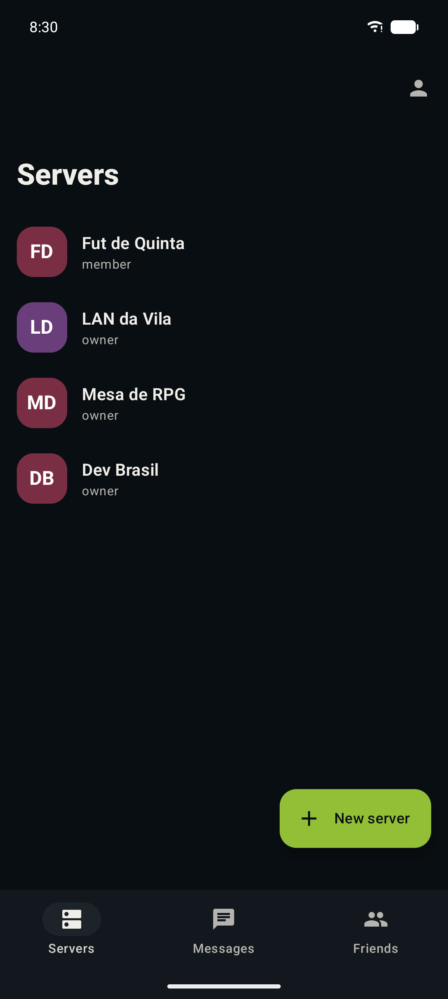
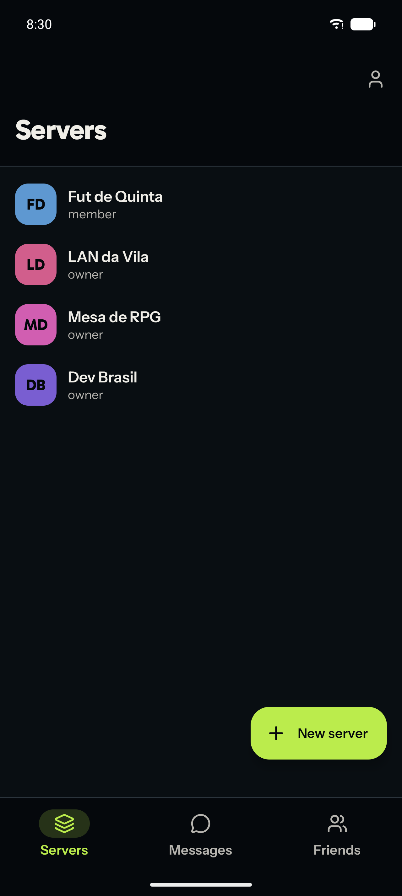
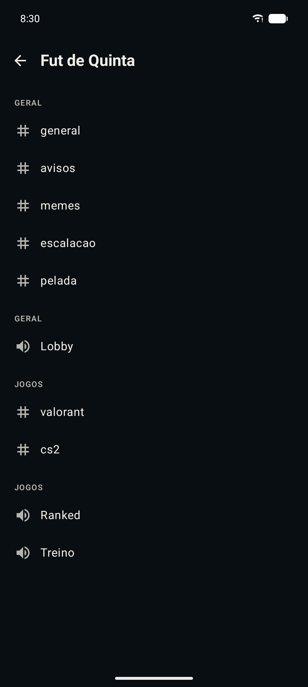
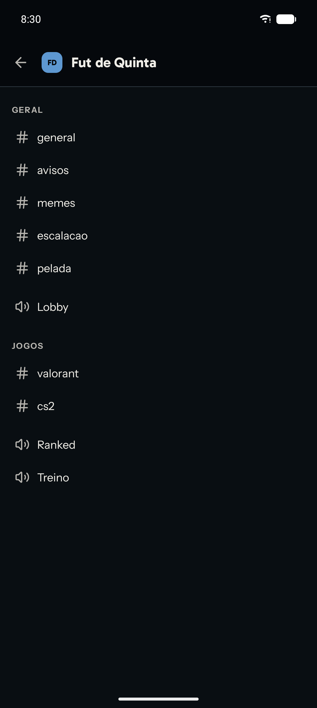
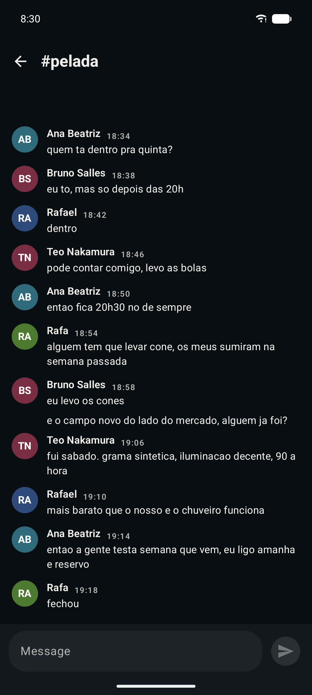
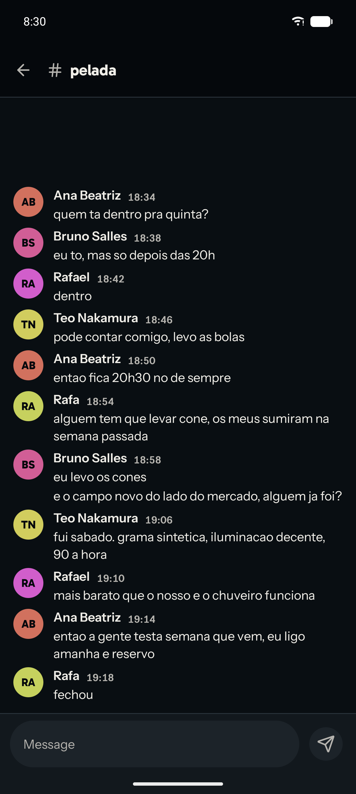
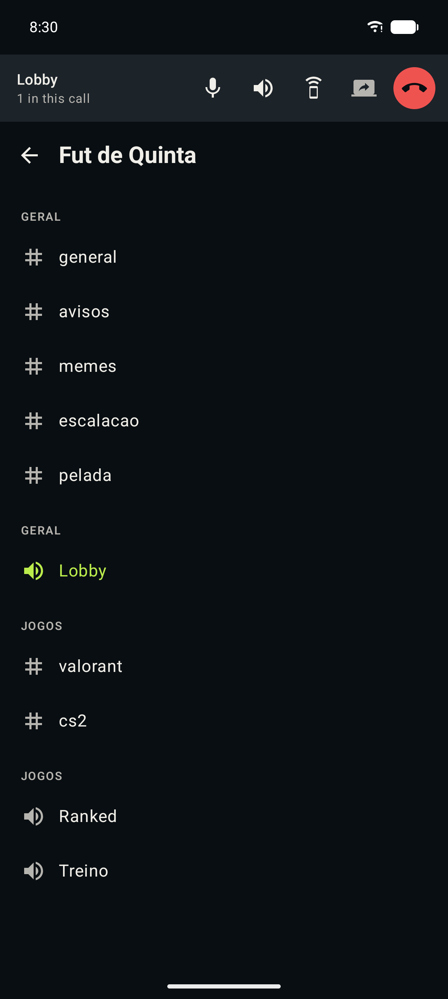
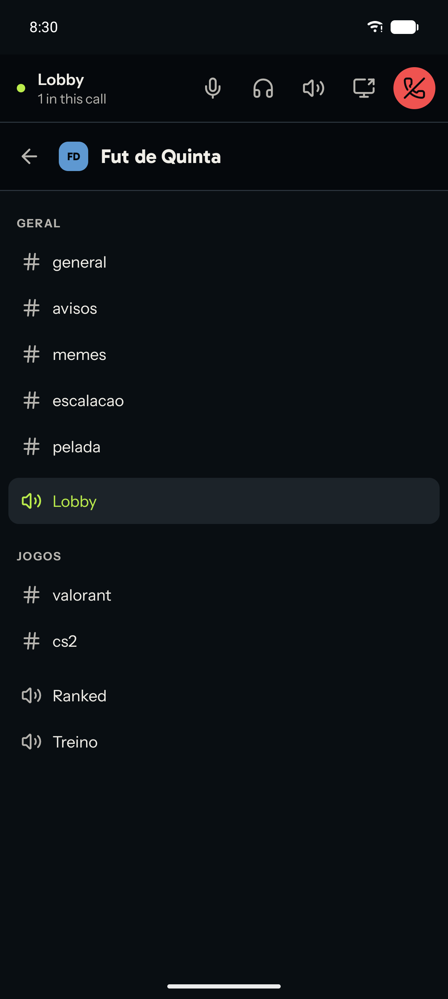
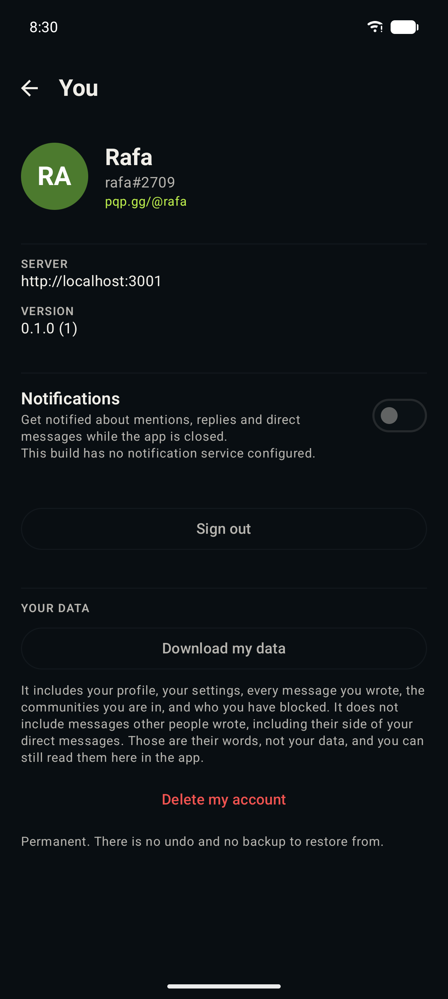
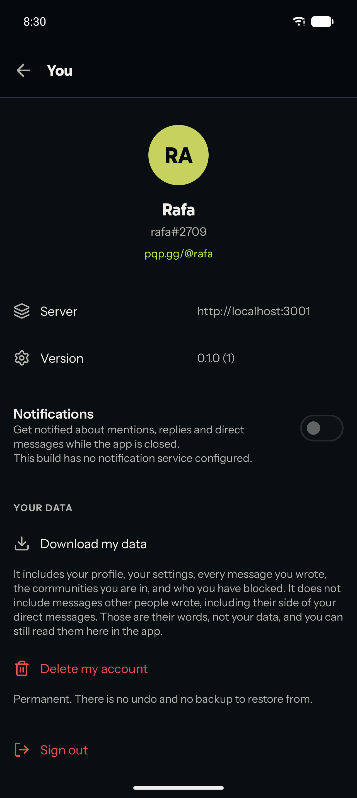

# Android design language

Companion to [`ANDROID.md`](./ANDROID.md), which says what the app **is**. This
says what it should **look like**, and why.

It exists because the first build got the palette and nothing else. The colours
in `ui/theme/Theme.kt` were converted correctly from `client/src/index.css` by
way of `ios/pqp/Sources/Design/Theme.swift`, and then every one of them was
handed to a stock Material 3 component at its default type, default density,
default shape and default elevation. The result was idiomatic Android, and
idiomatic is not designed: it looked like the Settings app wearing pqp's
colours. Discord's Android app is unmistakably Discord and is still a good
Android citizen. That is the bar.

**What this document does not touch.** Navigation, gestures, back behaviour and
the platform contract stay exactly as they are: a three-tab home with a bottom
`NavigationBar`, a drill-down into channels and chat, predictive back, edge to
edge, `LargeTopAppBar` collapse on scroll, `PullToRefreshBox`, system share and
permission dialogs. Material You stays off for the reason already written in
`Theme.kt`. This is a visual pass on top of platform behaviour that was already
right.

---

## What it looks like

Five screens, before and after, captured on one emulator so the two columns are
comparable rather than merely adjacent.

**Before** is `android-integrated` with none of this work applied. **After** is
this branch. Same AVD (Pixel 10 Pro, API 37.1, 1280x2856 at 480dpi), same font
scale (1.0), same dark theme, same account, same server, same channels, same
local server with the same seeded content, same scroll position. Both builds are
`:app:assembleDebug` installed over each other on that one device, so nothing
about the device changed between the two columns. Only the APK did.

| | Before (`android-integrated`) | After (this branch) |
|---|---|---|
| **Servers** |  |  |
| **Channels** |  |  |
| **Chat** |  |  |
| **Call strip** |  |  |
| **Account** |  |  |

What to look at, screen by screen:

- **Servers.** Roboto against Gabarito and Instrument Sans. The six hand-written
  avatar literals, which put three of four servers in the same maroon, against
  the hashed hue. The bottom bar lighter than the page against the bottom bar
  deeper than the page, with a hairline instead of a tonal step, and the active
  tab carrying the lime rather than a grey pill.
- **Channels.** The before repeats the category rule twice, once for the text
  channels and again for the voice channel underneath, because the header was
  drawn per group rather than per category. Row height drops from the Material
  default to 44dp, and the server monogram joins the title.
- **Chat.** The same twelve messages in Roboto and in Instrument Sans, with the
  author line set in Gabarito. Timestamps are tabular figures, so 18:34 and
  19:14 occupy the same width. Avatars take the hashed hue, which is why four
  speakers get four clearly different colours on the right and two of them are
  near-identical maroons on the left. Note that this pass did not buy vertical
  room: the right column is very slightly taller per message, not tighter.
- **Call strip.** The lime dot that means live, headphones for deafen where the
  old icon was another speaker and therefore the same metaphor as the speaker
  toggle beside it, a single Lucide stroke across all five controls, and the
  channel you are in drawn as an inset pill in the list underneath rather than
  as coloured text on the page.
- **Account.** Two labelled rows become a settings list with icons; the
  destructive actions are grouped at the bottom and drawn as what they are,
  rather than "Sign out" sitting mid-page as an outlined button.

**One honest caveat about the chat pair.** `#pelada` holds twelve messages,
about 6 KB of response. That is a real conversation and it is the whole channel,
not a crop, but it is not a long transcript: a channel whose message list comes
back at around 10 KB currently renders empty against a local dev server, on this
branch and on `android-integrated` alike. That bug is described at the end of
this document. It is the reason the chat pair uses a channel this size, and it
is not a regression from this work.

---

## The language in one paragraph

pqp on Android is **near-black paper with one lime signal on it, set in two
faces and drawn in one stroke.** Chrome is deeper than content, never lighter,
so a page reads as a sheet laid on a rail rather than as a card floating above
one. Separation comes from the surface ramp and a one pixel hairline, never from
a shadow and never from Material's tonal overlay. Headings are Gabarito, tight
and heavy; everything anyone reads for longer than a second is Instrument Sans.
Icons are a single Lucide stroke weight, so they sit beside the text instead of
shouting over it. Rows are tighter than Material's defaults because a chat
client is a list of short strings and forty of them should fit on a screen. The
lime appears about once per screen and it always means the same thing: **this is
the thing to act on, or this is live right now.**

---

## Typography

### The faces

| | Web | iOS | Android (now) |
|---|---|---|---|
| Body | Instrument Sans | system | **Instrument Sans, shipped** |
| Display | Gabarito | system rounded, heavy | **Gabarito, shipped** |
| Handle | Bricolage Grotesque | not used | not shipped |
| Brand | Dela Gothic One | not used | not shipped |

iOS uses the system face **deliberately and with a written reason**: on that
platform the system face is a design decision, San Francisco is genuinely good,
and the reader's Dynamic Type setting is a contract. None of that transfers.
Android's default is Roboto, Roboto is the most-seen typeface on the platform,
and "we used the default" is exactly what the app looked like.

So both faces are shipped, from `google/fonts`, **byte for byte, not subset**:

| File | Size | Licence |
|---|---|---|
| `res/font/instrument_sans.ttf` | 194 KB | OFL 1.1, `app/licenses/OFL-InstrumentSans.txt` |
| `res/font/gabarito.ttf` | 158 KB | OFL 1.1, `app/licenses/OFL-Gabarito.txt` |

**352 KB, and what that bought.** The release APK is 54.6 MB after R8 and the
resource shrinker, almost all of it the WebRTC native libraries, so the two
fonts are **0.6%** of what a tester downloads. They are stored rather than
deflated (`res/KF.ttf` and `res/w_.ttf` in the APK, at exactly their original
sizes) because Android memory-maps a font file, so the compressed number and the
shipped number are the same. A
subset with the `wdth` axis dropped and the charset cut to Latin would land
around 60 KB the pair, and would also be two binaries nobody in this repo could
regenerate, diff or explain the provenance of. The upstream files can be checked
with one `curl` against `ofl/instrumentsans` and `ofl/gabarito`. That trade goes
the other way the day this app is a 4 MB APK; it does not go that way today.

Both are **variable** (one `wght` axis each), so one file per family covers
every weight instead of four static instances, and 500 and 600 are real weights
rather than a synthetic smear. Variable axes need API 26 and `minSdk` is 26.

**Bricolage Grotesque and Dela Gothic One are deliberately absent.** The first
is the web's handle face and this client renders an `@handle` nowhere yet; add
it the day it does. The second is a wordmark face whose file carries a Japanese
kana set, so it would be the largest thing in `res/` in exchange for a logo that
is already drawn as a vector.

### The scale

Stated, not inherited. Material's defaults are tuned for Gmail and Settings:
16sp body on 24sp leading, 22sp titles, generous everywhere. Lives in
`ui/theme/Type.kt`.

| Role | Face | Size / line | Weight | Tracking | Where |
|---|---|---|---|---|---|
| `displaySmall` | Gabarito | 34 / 38 | 800 | -0.6 | Sign-in, the one hero |
| `headlineLarge` | Gabarito | 30 / 34 | 800 | -0.5 | Expanded `LargeTopAppBar` |
| `headlineMedium` | Gabarito | 26 / 30 | 800 | -0.4 | Sheet titles |
| `headlineSmall` | Gabarito | 21 / 26 | 700 | -0.2 | Empty-state titles |
| `titleLarge` | Gabarito | 19 / 24 | 700 | -0.1 | Collapsed app bar, `#channel` |
| `titleMedium` | Instrument Sans | 16 / 21 | 600 | 0 | Server name, dialog title |
| `titleSmall` | Instrument Sans | 15 / 20 | 600 | 0 | Message author, person's name |
| `bodyLarge` | Instrument Sans | 15 / 21 | 400 | 0 | **Message body**, channel name |
| `bodyMedium` | Instrument Sans | 14 / 19 | 400 | 0 | Secondary lines |
| `bodySmall` | Instrument Sans | 13 / 17 | 400 | 0 | Previews, reply excerpts |
| `labelLarge` | Instrument Sans | 14 / 18 | 600 | 0.1 | Buttons, tab labels |
| `labelMedium` | Instrument Sans | 12 / 15 | 600 | 0.2 | Badges, timestamps, metadata |
| `labelSmall` | Instrument Sans | 11 / 13 | 700 | 1.1 | **Uppercase section rules** |

Three things in that table are decisions rather than numbers:

- **Negative tracking on the display face.** Gabarito is a geometric sans that
  sets wide. At 26sp and above the default spacing opens words up until a
  two-word title reads as a banner. Pulling it in is what makes a heading read
  as one object.
- **`bodyLarge` is 15sp on 21sp, not 16 on 24.** That is the message body, and
  it is the single number that decides how much conversation fits on a phone.
  15/21 is a comfortable read at arm's length and fits roughly a fifth more than
  Material's default.
- **`labelSmall` carries 1.1sp of tracking, and is for uppercase only.** It is
  the only role with more than a hair of it, because it is the only role set in
  capitals, and uppercase without tracking is a wall. The corollary is a rule:
  **nothing lowercase may use `labelSmall`.** Two of the four implementation
  agents independently reported that a timestamp set in it reads loose, which is
  the tracking doing its job in the wrong place. Timestamps and relative times
  are `labelMedium`.

Every style also sets `includeFontPadding = false` and centres its extra
leading. Without that, every single-line row in the app sits a pixel or two
above its own centre: invisible on one row, and read as "sloppy" down a list of
forty.

**Tabular figures.** Timestamps beside every message and counts that tick are
columns of digits that change while somebody is looking at them. Proportional
figures shift the text either side on each tick, which the eye reads as flicker.
`Type.kt` exposes `TabularFigures`; anything numeric and live sets
`fontFeatureSettings = TabularFigures`.

**Dynamic type.** `sp` throughout, so the reader's font-size setting works. The
row heights in §Density are minimums, not fixed heights: a row grows.

---

## Colour, which is about usage and not values

**The palette does not change.** Same hex values as `client/src/index.css` by
way of `ios/pqp/Sources/Design/Theme.swift`, and nothing in this pass touched a
number. What changed is where each one is allowed to appear.

### The surface hierarchy

Material's `surfaceContainer*` ramp reads "higher is closer". pqp reads it in
both directions on purpose, and this is the single most important table here:

| Material role | Colour | Meaning | Used by |
|---|---|---|---|
| `surfaceContainerLowest` | `InkDeep` `#05080C` | **Chrome** | App bars, bottom navigation, the call strip |
| `background` / `surface` | `Ink` `#090E12` | **The page** | Message lists, channel lists, anything scrollable |
| `surfaceContainer` | `Surface` `#12181D` | **Lifts** | The composer, cards, sheets, dialogs |
| `surfaceContainerHigh` | `SurfaceRaised` `#1C2329` | **Reacts** | Pressed rows, the selected channel pill, chips, inline code |
| `surfaceContainerHighest` | `SurfaceRaised` | the same, deliberately | see below |

Chrome is **deeper** than the page. That is the web app's `--color-rail`, which
is `oklch(0.13)` against a `--color-surface-0` of `oklch(0.16)`, and it is the
reason a pqp screen reads as a sheet laid on a rail rather than as a card
floating above one. Material's instinct is the opposite; this is the place the
app stops being Material-shaped.

`surfaceContainerHighest` is the same colour as `surfaceContainerHigh` on
purpose. A fifth step in this range is invisible, and all it would buy is a way
for two components to disagree about which one they are on.

Light mode inverts the roles rather than the ramp: chrome becomes the tinted
card (`LightChrome`) and the page becomes white. That inversion is why chrome is
a named role in `Palette` and not an alias.

### Elevation without tonal overlays

`LocalTonalElevationEnabled` is **off**, in `PqpTheme`, and it is load-bearing.
With it on, every Material surface carrying a `tonalElevation` mixes a
translucent wash of `primary` into itself, so on this palette a raised card
comes out faintly lime and a dialog comes out a shade nobody chose. With it off,
a surface's colour is exactly what the ramp above says it is.

Separation is then made of two things and only two:

1. **The ramp.** A step is a real, chosen colour.
2. **A hairline.** One pixel of `outline` (`#2B343C`), and it is the only line
   in the app.

A rule appears **only where two different kinds of surface meet**: under an app
bar, above the composer. Rows inside a list are separated by rhythm, never by a
rule. A divider between every row is what turns a list into a form, and it is
half of why the first build read as Settings.

Shadows are used in exactly three places, because all three genuinely float over
content rather than sitting in the stack: the FAB, dialogs, and the call strip
when a list scrolls under it. Every one of them is tight and black, never a
soft grey halo.

### Where the Signal is allowed

The comment in `Theme.kt` has always said *sparingly, and never behind long-form
text*. Honoured, and made specific. The lime may appear as:

- the fill of the **one** primary action on a screen (a FAB, a confirm button)
- the selected item in the bottom navigation bar: indicator at low alpha, icon
  and label at full
- the **speaking ring** on somebody's avatar
- the live dot and the pulse on the call strip
- a **mention** badge (an unread badge that is not a mention is a neutral chip;
  the badge already says "there is something here" by existing)
- the `#` and the name of the channel you are currently in
- inline code and links, which is `--color-code-text` on the web

And it may not appear as: a fill behind any paragraph, a row background, an
avatar fallback colour, a section heading, a divider, a chart, or a second
loud thing on a screen that already has one. **One lime object per screen** is
the rule; two is the bug.

`SignalDim` is the pressed state of anything lime, never a second accent.

### Semantic colours

`Success`, `Warning`, `Danger` are for presence dots, moderation notices and
destructive confirmations. They are never decoration and never a category
colour. Presence in particular is the four states in `SocialComponents.kt`, and
`invisible` is deliberately not among them.

### Monogram colours, which were wrong

The avatar fallback used to pick from six hand-written literals: a teal, a
maroon, a brown, an olive. Six colours chosen one at a time never agree with
each other, and a column of them read as a column of unrelated apps' icons. They
also had nothing to do with pqp, and white initials on a mid-dark ground are
hard to read at 40dp.

The rule now is the iOS client's: **hue is derived from a stable djb2 hash of a
seed; saturation and value are fixed at 0.55 / 0.82.** Every monogram in the app
is therefore a bright colour of the same weight with `InkDeep` initials on it,
so a list reads as one designed set. The same person is the same colour on every
screen, between launches, and on iOS when the seed is the same id.

djb2 rather than `String.hashCode` because `hashCode` clusters on short similar
strings, and a server list of near-identical names came out three shades of one
colour.

---

## Iconography

**Lucide**, drawn as `ImageVector`s from Lucide's own path data, in
`ui/theme/PqpIcons.kt`. One stroke language throughout: a 24 unit box, 2 unit
strokes, round caps, round joins, no fills. That geometry is Gabarito's
geometry, so the icons and the headings look like they came from one place.

### Why not `Icons.Default.*`

Two reasons, and the second is the one that matters.

1. Material Icons Filled are solid shapes at a single optical size. A filled
   glyph beside Instrument Sans at 15sp is heavier than every letter next to it,
   so an icon wins a row it was only meant to label.
2. They are the most recognisable "this is a default Android app" signal there
   is. `Icons.Filled.Dns` for a server, `Icons.Filled.Tag` for a channel and
   `Icons.Filled.Person` for a person are three shapes every Android user has
   seen in Settings this week.

### Licence and weight

Lucide is **ISC**, and the notice is reproduced in full at the top of
`PqpIcons.kt` as the licence requires. There is **no dependency and nothing
fetched at build time**: the ~40 paths are checked in as strings, which costs a
few KB of Kotlin, lets a glyph be nudged by hand, and means the set cannot drift
under the app. `ImageVector`s are built `by lazy`, so an icon that is never
shown is never constructed.

`androidx.compose.material.material-icons-extended` has been **removed** from
`libs.versions.toml` and from `build.gradle.kts`. Every `Icons.Default.*`,
`Icons.Filled.*` and `Icons.AutoMirrored.*` in the app is gone, so the artifact
was buying nothing but a very large set of glyphs this language does not use.
The absence is commented at the dependency site, because the next person to want
an icon will reach for it by reflex.

### The two arguments worth having

- **Deafen is headphones, not a crossed-out speaker.** The old `VolumeOff` was
  the same metaphor as mute one button along, so the two loudest controls in a
  call were a crossed microphone and a crossed speaker. Ears and mouth are
  different organs and the icons should say so.
- **A server is `layers`, not `Dns`.** `Dns` draws a rack of servers, which is
  what the word means to an administrator and not what it means to somebody
  joining a place to talk in.

### Addressing them

Screens address an icon by **the job it does**, not the shape it is:
`PqpIcons.HangUp`, not `PqpIcons.phoneOff`. Swapping a glyph is then one line in
one file rather than a sweep through six. The raw Lucide names live in a private
`Lucide` object (they have to: `Lucide.search` and a public `PqpIcons.Search`
compile to the same JVM getter).

Sizes: **20dp inline** beside text, **22dp** for an action in an app bar or a
control strip, **26dp** in an empty state. Never 24dp-in-a-48dp-box next to
15sp text; that is the Settings proportion.

---

## Density and spacing

The 4dp grid, in `ui/theme/Theme.kt` as `Spacing` and `Sizes`. A single
`Spacing.gutter` of 16dp, so nothing is a pixel out from anything.

This section is most of what makes the app feel like a product rather than a
settings screen, and it is almost entirely about three rows.

### A chat row

```
16dp │ ●36 │ 12dp │ Author 15/600   12:04 (tabular, muted, 11sp)
     │     │      │ Message body, bodyLarge 15 / 21
```

- Page gutter 16dp, avatar 36dp, gutter 12dp. The text column therefore starts
  at **64dp** and stays there whether or not the row has a header.
- **Ungrouped** row: 6dp above. **Grouped** row: 2dp. A grouped row indents by
  the same 64dp and shows nothing where the avatar was, which is what makes a
  transcript read as conversation rather than as a log.
- Grouping is unchanged behaviour: same author, within five minutes.
- The row's pressed state is `surfaceContainerHigh` across the full width, edge
  to edge, with no corner radius. A message is part of a continuous transcript,
  not a card.
- The reply excerpt above a body is `bodySmall`, one line, muted, and it carries
  a 2dp lime-dim left rule at the 64dp column so it reads as quoted rather than
  as a first sentence.

### A channel row

```
8dp │ ┌ 12dp │ #20 │ 10dp │ general (bodyLarge) ┐ │ 8dp
    │ └───────── 44dp tall, radius 10dp ────────┘ │
```

- **44dp**, not Material's 56dp list item. A channel name is one short word and
  a server has twenty of them.
- The row is a **pill inset 8dp from the page gutter**, with a 10dp radius. It
  is empty until the row is selected or pressed, and then it is
  `surfaceContainerHigh`. That inset pill is simultaneously the most
  Discord-like thing in the app and exactly what `NavigationDrawerItem` does, so
  it is both identity and platform.
- The glyph sits in a fixed **20dp box** so `#`, the speaker and the padlock all
  start their name at the same x.
- The channel you are currently in: lime glyph, lime name, pill filled. That is
  the whole treatment; no bold, no dot, no second signal.
- Categories are a `SectionLabel`: `labelSmall`, uppercase, muted, 24dp above
  and 8dp below.

### A person row

- **56dp**, avatar 40dp, gutter 12dp, name `titleSmall`, second line
  `bodySmall` muted.
- The presence dot is 1/3.4 of the avatar, bottom-trailing, with a 2dp ring in
  the **surface the row sits on** so it reads as cut out of the picture rather
  than stuck on top. That ring colour is why a person row on a sheet and a
  person row on the page are not the same component call.

### The rest of the ladder

| Row | Height | Avatar |
|---|---|---|
| Channel | 44dp | none |
| Person (friends, members, search) | 56dp | 40dp |
| Server | 64dp | 44dp squircle, radius 14 |
| Conversation (inbox) | 72dp | 44dp |

A server's icon is a **squircle** and a person's is a **circle**. A server is a
place and a person is a person, and that is the same distinction Material draws.

### The large app bar

`Sizes.largeTopBarExpanded` is **124dp**, against Material's 152dp default,
and every `LargeTopAppBar` in the app uses it. 152 is a two-line hero for
titles that are one short word here; 124 leaves the headline room to breathe
and puts one more row on screen at rest. The collapse behaviour is untouched.
Only the height it collapses from moves.

It is a token and not a number at each call site because the **three home tabs
cross-fade into one another**. Servers, Messages and Friends are the same bar
seen three times, so one of them standing 28dp taller than the other two is not
a difference in a screen, it is the title dropping under somebody's thumb when
they change tab, and an empty band above two screens out of three. Any new
large bar uses the token.

### The rail and the channel list as chrome

The channel list is the web app's sidebar, brought to a phone. It is not a list
of settings.

- The app bar carries the server: its squircle icon at 28dp, its name in
  `titleLarge`, on `InkDeep`, with a `ChromeDivider` under it.
- The list underneath is on `Ink`, so the bar is visibly the frame.
- Section rules, then pills. No dividers anywhere in it.

The bottom `NavigationBar` gets the same treatment: container `InkDeep`,
indicator lime at low alpha, selected icon and label full lime, unselected
`onSurfaceVariant`. Three destinations, badges on two of them, unchanged
behaviour.

---

## Shape, elevation and motion

### Corners

Set once in `PqpTheme`'s `Shapes`, so every Material component picks them up:

| Role | Radius | Used by |
|---|---|---|
| `extraSmall` | 6dp | Badges, inline code, tooltips |
| `small` | 10dp | Buttons, text fields, the channel pill |
| `medium` | 14dp | Cards, a server's squircle |
| `large` | 20dp | Dialogs, menus |
| `extraLarge` | 28dp | Bottom sheets, the composer pill |

Material's defaults run 4 / 8 / 12 / 16 / 28: a soft ramp with one outlier at
the top. This one is tighter at the bottom and rounder at the top, so "a chip"
and "a sheet" are legible apart at a glance.

### Dividers versus surfaces

Restated because it is the rule most easily broken: **a divider means two kinds
of surface meet.** Everything else is separated by a change of ground or by
rhythm. If a screen has a divider between every row, it is wrong.

### Motion

Two curves, in `ui/theme/Theme.kt` as `Motion`. Two used consistently read as
intentional; a different duration per call site reads as noise. Same argument
the iOS client's `Motion` makes, in Compose's spelling.

| Curve | Spec | For |
|---|---|---|
| `Motion.standard` | spring, damping 0.82, stiffness 380 | something appearing, moving or resizing |
| `Motion.press` | spring, damping 0.7, stiffness 1400 | a press, a toggle, a button waking up |
| `QUICK_MILLIS` 140 | tween | colour crossfades, where a spring overshoots visibly |
| `SETTLE_MILLIS` 260 | tween | a bar expanding, a banner arriving |

What moves:

- **The speaking ring** grows in on `press` and out again. It is the only
  animation in a message list, and it is the only one that carries information.
- **The send button** wakes on `press` when the composer stops being empty:
  container from `surfaceContainerHigh` to lime, icon from muted to ink.
- **The call strip** expands and collapses vertically on `SETTLE_MILLIS`, which
  it already did; it keeps doing it, now against chrome rather than a tonal
  surface.
- **Tab switches** cross-fade on `QUICK_MILLIS`. Not a slide: the three tabs are
  peers, and a slide implies an order the back gesture does not honour.
- **Pressed rows** take their surface immediately and release it on
  `QUICK_MILLIS`. A row that fades in its own highlight feels laggy.

What does **not** move, and must not be made to:

- **Navigation transitions.** Navigation Compose's defaults are the platform's,
  they are what the predictive back gesture animates against, and a bespoke
  slide breaks that cooperation. The note in `PqpApp.kt` says so already and it
  stays true.
- **List entrances.** A staggered cascade is charming on the first launch and
  tiresome by the fourth. A chat list in particular must arrive instantly.

---

## What is still not designed

Honest list, so nobody has to rediscover it. Most of it was reported by the
people who did the work rather than found later.

### Things the platform fought back on

- **The composer pill is 53dp, not the 44dp the density section asks for.**
  Material 3's `String`-based `TextField` has no `contentPadding` parameter, only
  the `TextFieldState` overload does, and its decoration box adds 16dp above and
  below regardless of `heightIn`. Getting a true 44dp means `BasicTextField` plus
  `TextFieldDefaults.DecorationBox`, which means hand-rolling the cursor brush,
  the text style and an interaction source. Not worth it for 9dp today.
- **A screen share's rounded frame is painted, not clipped.**
  `SurfaceViewRenderer` is a `SurfaceView` and composites in its own layer, so a
  Compose `clip` does not reach it. The radius and the hairline are drawn around
  it. That reads correctly on ink and would not on a pale surface.
- **A message row has no pressed state.** The design calls for one, but the row
  is not clickable and has no interaction source, and giving it one would be new
  behaviour rather than a restyle. It arrives with message actions.
- **The call strip has no shadow when a list scrolls under it.** It needs the
  scroll state of whichever screen is below, which lives in `PqpApp.kt`, above
  every screen that would supply it.

### Things the data does not support yet

- **A one-to-one conversation row is one line.** The inbox wants a muted preview
  of the last message, and `DmSummary` carries only `lastMessageAt`. The row is
  72dp with a single line centred in it until the API grows a preview field.
- **The group conversation avatar clips the back face's initials** under the
  front one. Two circles at 72% in a 44dp box cannot do better; it wants a real
  drawing, not a parameter.
- **`PqpIcons.EnterFullscreen` is unused.** The screen-share viewer has one
  control and no enter/exit toggle to wire it to.
- **No `@handle` is rendered anywhere**, which is why Bricolage Grotesque is not
  shipped. When the profile surface lands, that face comes with it.

### Things that are genuinely unfinished

- **The sign-in screen in Clerk mode.** `AuthView` is Clerk's own component,
  used as shipped for the reason in `SignInScreen.kt`. Three of its appearance
  hooks have now been tried and all three are used: `logo` puts the pqp mark in
  what was an empty top bar, `clerkTheme` sets the ground to `Ink` so the screen
  is one colour rather than Clerk's `#131316` inside our window, and `modifier`
  lifts the whole block off the status bar because Clerk top-aligns the form in
  its own full-screen `Scaffold`. What is still Clerk's is everything inside the
  form: the field, the buttons, the divider, the type. Those are reachable
  through the rest of `ClerkColors` and through `ClerkTypography`, and nobody
  has tried those. Note that Clerk's scaffold **does not scroll and applies no
  IME inset**, so any height taken from outside is height the tallest step of
  the flow loses; the lift gives itself up while the keyboard is open for
  exactly that reason.
- **The friends screen can show three lime objects at once**: the Add friend
  FAB, the accept button on a request, and the Pending badge. Each is correct on
  its own and together they break the one-lime-per-screen rule. Demoting the FAB
  while requests are pending would be conditional behaviour.
- **The account screen has two red rows**, delete and sign out. They are in
  different groups and only one opens a dialog, but two destructive-looking rows
  on one screen is one too many.
- **Light mode has been made coherent rather than designed.** Every role has a
  sensible light value, nothing vibrates, and the chrome-versus-page separation
  survives. But `LightChrome` and `LightGround` are close enough that the
  hairline does most of the work, the lime darkens to a fairly muddy olive on
  off-white, and nobody has sat with it. The identity is a dark identity.
- **Empty states now have an icon, a title and a sentence**, but most of them
  say one line taken from the old copy. Each deserves a written sentence in both
  languages, which is copy work rather than design work.
- **Attachments in a message** got a frame, rounding and a chip for non-images,
  and that is all. Attachments are not built on this client yet, so there was
  nothing real to design against.
- **The launcher icon and the splash** are the mark on ink and have not been
  revisited. They are fine and they are not distinctive.

### A bug found while looking, and not fixed

**A channel with more than about a dozen messages renders as an empty
transcript** against a local dev server. It reproduces identically on
`android-integrated` with none of this work applied, so it is not a regression.
The pattern is a response-size threshold rather than a message-count one: a 5 KB
messages payload loads, a 10 KB one does not, and over the LAN a 2.7 KB channel
list fails where a 2.1 KB server list succeeds. The app has no size-dependent
code path, which points at the emulator's networking rather than at the client.
It could not be isolated further because the debug cleartext exemption is
`localhost`-only, so the tunnel cannot be taken out of the picture without
editing `network_security_config.xml`. Worth ten minutes from whoever next has
a physical device on the same network.
